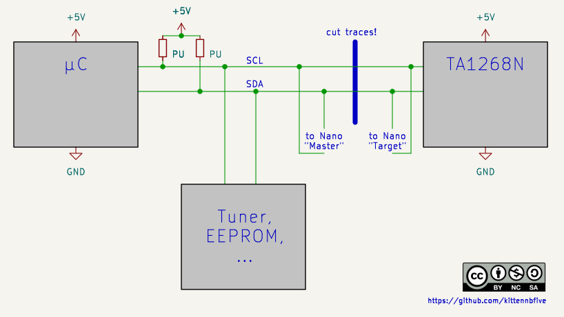
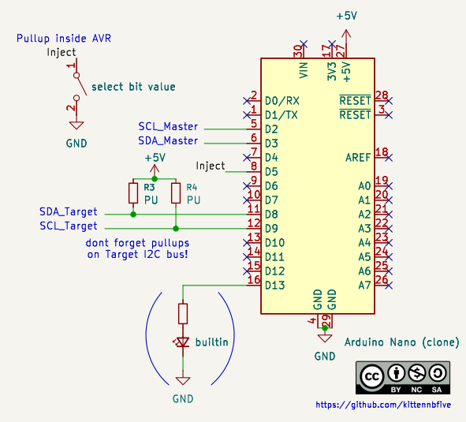

# ADB-i2c-MitM
A way for [Adrian](https://www.youtube.com/c/adriansdigitalbasement/) to (hopefully) further mod/improve his Sharp TV.

## What is this?
This code was made after i watched [Can I use the I2C bus to control the modded 13" TV? (Sharp 13J-M100)](https://www.youtube.com/watch?v=EsdyZgAiD1A) from Adrian's Digital Basement \]\[.
  
**Caution: spoilers ahead**
  
To summarize, Adrian [modded a TV](https://www.youtube.com/watch?v=tCO0kl_RxrI) to add an S-Video input and needed a way to enable or disable some internal filter on the fly for better image quality. The filter is inside an IC called TA1268N (datasheet floating around on the web) that is programmed via an I2C bus. In his second channel video (the first link above) he sniffed the I2C bus inside the TV and found that the IC is programmed again and again every 90ms (if i remember correctly). He concluded that simply changing the config bit for the filter *once* with an Arduino will not work as the main processor inside the TV will override the setting after a really short time.
  
After having watched this video i wondered if it would be possible to do some kind of a "man in the middle" attack by inserting a microcontroller between the processor of the TV and the IC. This repository contains the result of my experimentations.
  
The code was written from scratch and is in "plain" C (ie not the Arduino stuff). It is meant to be used with an Arduino Nano (the 5V and 16MHz version) or a bare ATmega328P.

I asked Adrian (alias [misterblack1](https://github.com/misterblack1) here) if he is interested in my code, but i did not get an answer. I assume he did not see my message which i posted as an issue on one of his repositories as i don't have his mail address or an account on Youtube to leave a comment there. In doubt i just publish my code, maybe it will be useful for somebody...

## Licence and Disclaimer
This stuff is Copyright (c) 2026 by kittennbfive.  
Code: GPLv3+  
Schematic/Pictures: CC-BY-NC-SA (permission is granted to Adrian to show it in a (monetized) video if he wants to, every other commercial use is prohibited)
  
EVERYTHING IS PROVIDED WITHOUT ANY WARRANTY! THIS IS EXPERIMENTAL STUFF! I obviously don't have the TV to test my idea/code in real conditions.

## Needed hardware
- An Arduino Nano (a clone is fine too) or a bare ATmega328P with all the usual stuff around, including a 16MHz crystal or ceramic resonator.
- Two extra pullup resistors, something like 3,3k should be fine.
- A switch (SPST) to select the value of the bit that controls the filter inside the TA1268N.

## Installation
### Compiling the code and programming the Arduino
There is only a single file. Use `avr-gcc -Wall -Wextra -Werror -fshort-enums -O3 -mmcu=atmega328p -o avr.elf -DF_CPU=16000000UL main.c` to compile.
Flash with your favourite tool. If you use an Arduino you can either program it via serial using the bootloader (don't ask me for details, i don't know) or via ICSP (bootloader will be erased!).  
**Make sure you set the fuses correctly!** The Arduino *must* run at 16MHz (from the external crystal or ceramic resonator) and the internal clock divider (/8) *must* be disabled. For my tests i used `avrdude -p m328p -c usbasp-clone -U lfuse:w:0xd6:m -U hfuse:w:0xd9:m -U efuse:w:0xff:m`. **Note that these settings are NOT compatible with a bootloader.**

### Installation inside the TV
For anybody else who might try this: Please only work on a TV if you know how to do it safely. There is potentially **lethal** voltage inside and other dangers!

For installation you will need to cut the traces carrying SCL and SDA to the TA1268N (only the traces to this one IC!). Then solder some wires and "insert" the Arduino between the I2C bus from the TV processor (which i called "master") and the TA1268N ("target"). On the TA1268N side you *must* add 2 pullup resistors, something like 3,3k between each line and +5V.
  
The Arduino (pin "D5") also needs to be connected to a switch that switches to ground. The code reads this pin for the bit value to inject inside the I2C commands.

Obviously the Arduino will also need +5V and GND.

  


## Details of operation
### The simple way (that probably wouldn't work)
The easiest way for doing this on-the-fly modification would be to use something called "I2C clock stretching". In this mode the adressed slave will pull SCL low to effectively stop the master as long as needed. The inserted Arduino could use this to stop the master (the processor inside the TV) while forwarding the request to the TA1268N and then release SCL to allow the master to resume operation. However this mode (clock stretching) is often not implemented inside I2C masters, so i don't think it would have worked for this TV.

### The hard way (that hopefully works)
The other (much more difficult) way is to forward all I2C transactions *as soon as possible* to the slave (the TA1268N) without using clock stretching. This is tricky, as we have to forward the address (while checking if the TA1268N or something else is being written to), the data (and subadress, refer to the datasheet of the TA1268N), possibly modify data on the fly (the bit we want to change) and also take care about the ACK (or NACK) from the slave that needs to be written back to the master. This means that we have to do everything in software (by "bitbanging" I2C) as the internal I2C-peripheral of the ATmega328P is not suitable for stuff like this. This is the way my code works.

### Some other (small) difficulty
I2C uses Open Collector outputs, but the outputs on the ATmega328P are Push-Pull. However by switching between Input-mode and Output-mode with a low level it is not difficult to emulate the needed Open Collector mode. Just don't try putting a high level using Push-Pull on the bus, if another device pulls the bus low there might be magic smoke escaping.

### Reliable edge-detection
As stated in the code i had a lot of trouble *reliably* detecting edges (for START, STOP and clock) in software. I finally used the hardware that is present inside the ATmega328P for external interrupts, this seems to work *much* better.

## Timeout
In case something goes horribly wrong the code has a timeout that will trigger if a transaction has not finished (no STOP on the bus) after some time. The current value is 7,5ms; that should be plenty for Adrian's TV which uses 55kHz I2C clock frequency if i saw correctly in the video. You might need to tweak this value. If the timeout triggers the builtin LED of the Nano will blink several times and the code will go back to idle mode (ie wait for next START on the bus).

## Speed
This was a big problem. The Arduino runs at 16MHz which seems plenty compared to let's say the standard 100kHz clock for an I2C bus, however if you do the math you will find that there is not that much time / clock cycles of the Arduino between each I2C clock. Remember, we have to do everything in software.
  
I tested my code with another ATmega328P that was responding to address 0x88 (the one used by the TA1268N) and sends out all the received bytes via UART. The I2C transactions were generated using an old Bus Pirate. *Note*: At least my Bus Pirate (with probably old firmware) is way off for the displayed I2C clock frequency, the real frequency is about half of the displayed one. Also the I2C clock is highly unsymmetrical (about 21% duty cycle). This caused me some trouble as the Arduino has even less time between a rising and a falling edge of SCL.
  
I tested my code with yet another ATmega328P as an I2C master (using the internal peripheral with symmetrical clock pulses). My MitM-code worked up to about 250kHz, however this was **without** the extra timeout stuff. Still there should be enough margin for Adrian's TV with its 55kHz clock. If the I2C clock is faster you can always remove the timeout code. If you have 400kHz I2C clock (maximum in I2C fast mode) then you are in trouble, this code will not work. You would need a faster microcontroller or try rewriting the code in assembly maybe.

## Testing results
As said i used a Bus Pirate for testing. It was set to "~100kHz" (real about 54kHz measured) clock frequency. I then used this:
```
>[0x88 0x00 0x55][0x88 0x01 0x00][0x88 0x02 0xff][0x80 0x00 0xff][0x88 0x00 0x55]
I2C START BIT
WRITE: 0x88 ACK <-- write to TA1268N
WRITE: 0x00 ACK <-- subaddress 0x00 -> we need to modify the MSB of the data byte
WRITE: 0x55 ACK <-- original data byte
I2C STOP BIT
I2C START BIT
WRITE: 0x88 ACK <-- write to TA1268N
WRITE: 0x01 ACK <-- but another subaddress -> don't mess with the data, just forward it
WRITE: 0x00 ACK <-- actual data
I2C STOP BIT
I2C START BIT
WRITE: 0x88 ACK <-- same thing again with yet another subaddress
WRITE: 0x02 ACK 
WRITE: 0xFF ACK 
I2C STOP BIT
I2C START BIT
WRITE: 0x80 NACK <-- write to some other (non existent -> NACK) peripheral, the Arduino must ignore this (wait for STOP)
WRITE: 0x00 NACK 
WRITE: 0xFF NACK 
I2C STOP BIT
I2C START BIT
WRITE: 0x88 ACK <-- and again write to the TA1268N
WRITE: 0x00 ACK 
WRITE: 0x55 ACK 
I2C STOP BIT
```

On the emulated TA1268N-side i got this:
Pin "INJECT" is pulled low:
```
received 2 bytes: 0x00 0x55 <-- subaddress 0x00, MSB of data is 0
received 2 bytes: 0x01 0x00 <-- another subaddress, don't mess with the data byte
received 2 bytes: 0x02 0xff <-- same thing
received 2 bytes: 0x00 0x55 <-- subaddress 0x00 again, MSB of data is 0
```
Pin "INJECT" is pulled high:
```
received 2 bytes: 0x00 0xd5 <-- this time MSB of data is 1
received 2 bytes: 0x01 0x00 <-- but not here (another subadress)
received 2 bytes: 0x02 0xff <-- and not here (well it is as the master sent 0xff)
received 2 bytes: 0x00 0xd5 <-- and another modified data byte for subaddress 0x00
```

If needed / Somebody is interested i have some logic analyzer traces too.
